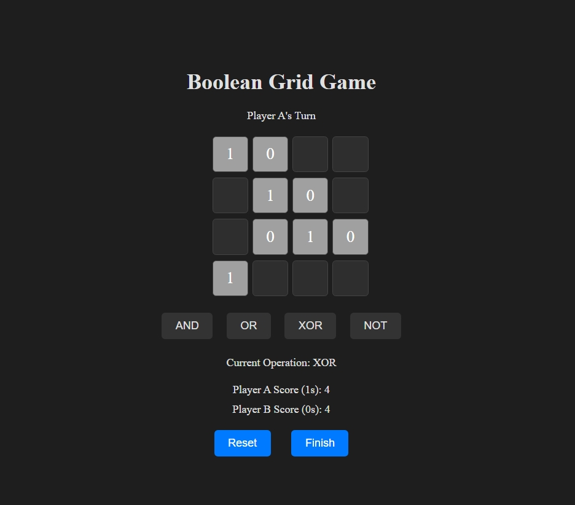

Description

A strategic grid-based game where two players, A and B, take turns to place and manipulate binary values (0 and 1) on a 4x4 board. Players can perform various logical operations (AND, OR, XOR, NOT) on adjacent cells. The game ends when all cells are filled, and the winner is determined based on the number of cells each player controls.

Features

Interactive Board: 4x4 grid where players place binary values.
Operations: Perform logical operations (AND, OR, XOR, NOT) on adjacent cells.
Scoring System: Tracks and displays scores for both players.
Game End: Determines the winner based on the scores.

Usage

Click on a cell to place your value (1 or 0).
Select an operation (AND, OR, XOR, NOT) to perform on adjacent cells.
Reset the game at any time using the Reset button.
Finish the game to determine and display the winner.

Contributing
Feel free to contribute to the project by submitting issues, pull requests, or suggestions. Please follow the project's code of conduct and guidelines for contributions.
